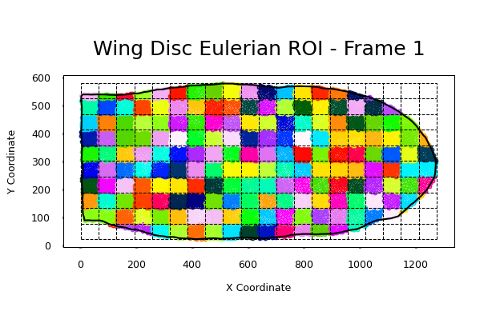
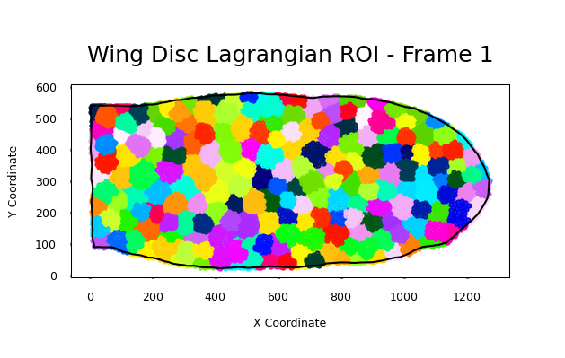
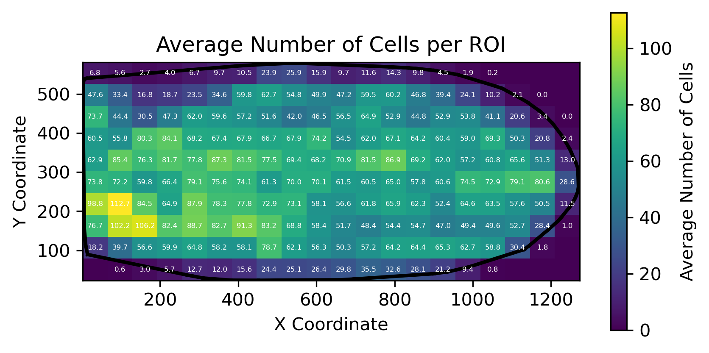
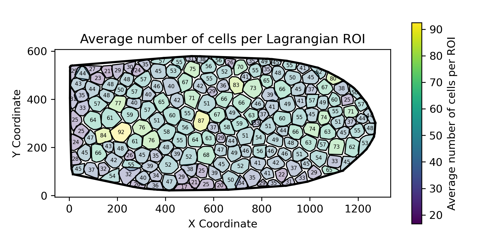

# Wing Disc Epithelial Topology Analysis

A modular Python package for analyzing epithelial cell topology in Drosophila wing disc tissue using time-lapse microscopy data.

## Overview

This package provides tools for quantitative analysis of cell shape distributions in epithelial tissues using two complementary approaches:

- **Eulerian Analysis**: Fixed spatial grid regions (ROIs) track how cell shapes evolve at specific tissue locations
- **Lagrangian Analysis**: Cell-centered ROIs that follow specific groups of cells over time

The analysis employs sophisticated statistical methods including:
- Bayesian smoothing (Dirichlet posterior)
- Jensen-Shannon divergence
- Wasserstein-1 distance
- Topological charge metrics (E[n-6])

**Project Status:** ✅ **Production-ready** with modular architecture, comprehensive test suite (33 tests), and extensive documentation.

## Features

✅ **Dual Analysis Frameworks**
- Eulerian (fixed-grid) ROI analysis
- Lagrangian (cell-tracking) ROI analysis

✅ **Comprehensive Metrics**n- Jensen-Shannon divergence (information-theoretic)
- Wasserstein-1 distance (geometric)
- Topological charge (E[n-6])
- Bayesian smoothing with Dirichlet prior

✅ **Production-Ready Code**
- Modular package structure (`src/wing_disc_analysis/`)
- Command-line interface with configurable parameters
- ~60% code reduction via deduplication

✅ **Robust Testing**
- 33 pytest tests (30 automated + 3 interactive)
- 100% pass rate, < 1 second runtime
- Edge case coverage (boundary cells, empty frames, etc.)

✅ **Comprehensive Documentation**
- 2 comprehensive guides in `docs/` directory
- Inline docstrings with type hints
- Quick start examples and tutorials

✅ **Reproducible Workflows**
- Pinned dependencies (`requirements.txt`, `environment.yml`)
- Deterministic tests with fixed random seeds
- Version control ready (`.gitignore` included)

## Images

This repository includes pre-generated visualization images in the `images/` folder. Below are the key visualizations embedded for quick inspection (relative paths are preserved if you want to open the files directly):

### Eulerian ROI (frame 1)



*Shows the fixed-grid (Eulerian) ROIs overlaid on frame 1 and the cell assignment used for per-ROI topology statistics.*

### Lagrangian ROI (frame 1)



*Shows the cell-centered (Lagrangian) ROIs that follow groups of cells in frame 1.*

### Average number of cells per Eulerian ROI



*Heatmap of the mean cell count observed in each Eulerian ROI across the time series (useful to evaluate sampling uniformity).*

### Average number of cells per Lagrangian ROI



*Analogous heatmap for Lagrangian ROIs (average cells per ROI over trajectories).*

These images are intended for quick visual checks and for inclusion in reports. To regenerate them from scratch, run the Eulerian and Lagrangian visualization scripts in `scripts/` (see the Quick Start examples).

## Installation

### Using Conda (Recommended)

```bash
# Clone the repository
git clone https://github.com/yourusername/Data_LiveCell.git
cd Data_LiveCell

# Create and activate conda environment
conda env create -f environment.yml
conda activate data_live_cell

# Install the package
pip install -e .
```

### Using pip

```bash
# Clone the repository
git clone https://github.com/yourusername/Data_LiveCell.git
cd Data_LiveCell

# Create virtual environment
python -m venv venv
source venv/bin/activate  # On Windows: venv\Scripts\activate

# Install dependencies
pip install -r requirements.txt

# Install the package in editable mode
pip install -e .
```

## Quick Start

### Eulerian Analysis

```bash
# Run with default parameters
python scripts/run_eulerian_analysis.py --data Xls_Data/all_frames_wing_discs.xls

# Customize grid size and output location
python scripts/run_eulerian_analysis.py \
    --data Xls_Data/all_frames_wing_discs.xls \
    --grid-x 15 \
    --grid-y 15 \
    --output Results_test \
    --alpha 1.0
```

### Lagrangian Analysis

```bash
# Run with default parameters
python scripts/run_lagrangian_analysis.py --data Xls_Data/all_frames_wing_discs.xls

# Customize target cells per ROI
python scripts/run_lagrangian_analysis.py \
    --data Xls_Data/all_frames_wing_discs.xls \
    --target-cells 50 \
    --output Results_lag_test
```

## Usage in Python

```python
import wing_disc_analysis as wda

# Load data
workbook = wda.io.load_workbook('Xls_Data/all_frames_wing_discs.xls')
frames = wda.io.read_all_frames(workbook)

# Eulerian analysis
grid = wda.roi.EulerianGrid(num_grid_x=20, num_grid_y=10)
# ... (see scripts/ for complete examples)

# Lagrangian analysis
lag_roi = wda.roi.LagrangianROI(target_cells_per_roi=46)
# ... (see scripts/ for complete examples)
```

## Project Structure

```
Data_LiveCell/
├── src/
│   └── wing_disc_analysis/      # Main package
│       ├── io/                  # XLS/ODS file reading
│       ├── geometry/            # Spatial operations, tessellation
│       ├── topology/            # Metrics and statistics
│       ├── roi/                 # Eulerian and Lagrangian ROIs
│       ├── visualization/       # Plotting functions
│       └── utils/               # Helper utilities
├── scripts/                     # Entry point scripts
│   ├── run_eulerian_analysis.py
│   └── run_lagrangian_analysis.py
├── tests/                       # Pytest test suite (33 tests) ✅
│   ├── test_topology_metrics.py # Topology metrics tests
│   ├── test_roi_eulerian.py     # Eulerian ROI tests
│   ├── test_roi_lagrangian.py   # Lagrangian tracking tests
│   ├── test_io_extraction.py    # I/O and data extraction tests
│   └── test_visual_plots.py     # Interactive visual tests
├── docs/                        # Comprehensive documentation
│   ├── PROJECT_DOCUMENTATION_REPORT.md
│   └── TESTING.md
├── Xls_Data/                    # Input data (not tracked in git)
├── Results_wing_eulerian/       # Eulerian outputs
├── Results_wing_lagrangian/     # Lagrangian outputs
├── setup.py                     # Package configuration
├── requirements.txt             # Python dependencies
├── environment.yml              # Conda environment
├── pytest.ini                   # Test configuration
└── README.md                    # This file
```

## Scientific Background

### Cell Topology

Epithelial cells in tissue form a polygonal tiling pattern. The distribution of polygon types (3-gon, 4-gon, 5-gon, 6-gon, 7-gon) provides insights into:
- Tissue mechanics and packing constraints
- Cell division and death dynamics
- Neighbor exchange events (T1 transitions)

### Metrics

**Jensen-Shannon Divergence (JSD)**
- Information-theoretic measure of distribution similarity
- Range: 0 (identical) to 1 bit (completely different)
- Symmetric and bounded, unlike KL divergence

**Wasserstein-1 Distance (W1)**
- Earth Mover's Distance for discrete distributions
- Units: polygon sides (geometric interpretation)
- Sensitive to ordinal structure of polygon classes

**Topological Charge**
- E[n-6]: Mean deviation from hexagonal packing
- E[|n-6|]: Mean absolute deviation (irregularity measure)
- Based on Euler characteristic constraints

## Data Format

Input data should be XLS workbooks from EpiTools segmentation pipeline:
- Each sheet = one time frame
- Columns: [Cell ID, X coordinate, Y coordinate, Polygon count]
- Cell ID = -1 for boundary cells

## Testing

This project includes a comprehensive test suite with 33 tests covering core functionality.

### Running Tests

```bash
# Activate the environment
conda activate data_live_cell

# Install pytest (if not already installed)
pip install pytest

# Run all non-interactive tests (fast, for CI/CD)
pytest -m "not interactive" -v

# Run interactive visual tests (manual inspection)
pytest -m interactive -s

# Run all tests
pytest -v
```

### Test Coverage

The test suite includes:
- **test_topology_metrics.py** (12 tests): Dirichlet posterior, topological charge, JSD, Wasserstein distance
- **test_roi_eulerian.py** (5 tests): Grid assignment, edge cases, clipping
- **test_roi_lagrangian.py** (6 tests): Nearest-neighbor tracking, empty frames, many-to-one mapping
- **test_io_extraction.py** (7 tests): Boundary filtering, frame counting, grouping
- **test_visual_plots.py** (3 interactive tests): Histogram, grid overlay, trajectory visualization

**Test Status:** ✅ 30/30 automated tests passing (< 1 second runtime)

### Interactive Visual Tests

Interactive tests open matplotlib windows and prompt for manual confirmation:

```bash
# Run interactive tests with input enabled
pytest -m interactive -s
```

These tests display:
1. Polygon distribution histogram
2. Eulerian grid overlay with color-coded cells
3. Lagrangian tracking trajectories with arrows

For more details, see `docs/TESTING.md`.

## Documentation

Comprehensive documentation is available in the `docs/` directory:

- **`docs/PROJECT_DOCUMENTATION_REPORT.md`**: Complete project overview, architecture, and implementation details
- **`docs/TESTING.md`**: Complete testing guide - automated tests, interactive validation, and contributing guidelines

## Dependencies

- Python ≥ 3.11
- NumPy ≥ 1.24
- Matplotlib ≥ 3.7
- SciPy ≥ 1.10
- Shapely ≥ 2.0
- xlrd ≥ 2.0

Optional:
- ezodf ≥ 0.9.6 (for ODS files)
- Pillow ≥ 9.0 (for image processing)

## Citation

If you use this package in your research, please cite:

```bibtex
@software{wing_disc_analysis,
  author = {Wing Disc Analysis Team},
  title = {Wing Disc Epithelial Topology Analysis},
  year = {2025},
  url = {https://github.com/yourusername/Data_LiveCell}
}
```

## License

[Specify your license here]

## Contributing

Contributions are welcome! Please:
1. Fork the repository
2. Create a feature branch (`git checkout -b feature/amazing-feature`)
3. **Add tests** for new functionality (required)
4. Run the test suite: `pytest -m "not interactive" -v`
5. Ensure all tests pass
6. Commit your changes (`git commit -m 'Add amazing feature'`)
7. Push to the branch (`git push origin feature/amazing-feature`)
8. Submit a pull request

### Testing Guidelines

- All new functions should have corresponding unit tests in `tests/`
- Tests should be deterministic (no randomness unless seeded)
- Use descriptive test names: `test_<function>_<scenario>_<expected_behavior>`
- Run tests before submitting: `pytest -v`
- Aim for edge case coverage (empty inputs, boundary conditions, etc.)

See `docs/TASK2_TESTING.md` for detailed testing strategy.

## Acknowledgments

- EpiTools team for segmentation software

**Data Acknowledgement.** The imaging data used in this project originate from the Drosophila wing disc datasets published by Etournay et al. (2015). We gratefully acknowledge their open data and the work that made this analysis possible; please cite Etournay et al. (2015) when reusing these imaging data in publications.

If you need a BibTeX or full citation for Etournay et al., add the preferred citation in this section or in `docs/`.
